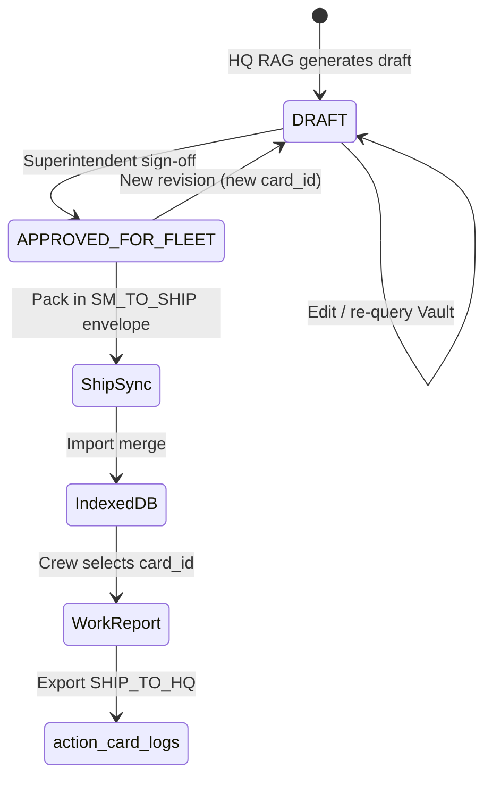

# Shore-HQ Vault RAG & Action Card Packaging

**Status:** Architecture specification (Phase 1 — docs + contract)  
**Related:** [`SYNC-ENVELOPE-V2.md`](SYNC-ENVELOPE-V2.md), [`VESSEL-ARCHETYPE-V0.md`](VESSEL-ARCHETYPE-V0.md), [`data-scope-policy.md`](data-scope-policy.md), [`PRICING-TIERS-V1.md`](PRICING-TIERS-V1.md) (Pro+ tier)

---

## Executive architecture

Maritime intelligence is **split by connectivity**. Shipboard Vessel Core stays **LLM-free** and **offline-safe** (`AGENTS.md`). All generative retrieval (OpenAI, Claude, pgvector) runs **only on Shore HQ** (TVC-SM / Supabase). Output is not free text in the sync path—it is a **governed Action Card** JSON object, signed and shipped inside **SYNC-ENVELOPE-V2** packages.

```text
┌─────────────────────────────────────────────────────────────────┐
│ Tier 1 — Shore HQ (online)                                       │
│  • Vessel-Specific Vault (manuals, circulars, Class rules)         │
│  • pgvector + LLM API (RAG, citations required)                  │
│  • Superintendent review → APPROVED_FOR_FLEET                      │
└────────────────────────────┬────────────────────────────────────┘
                             │ SM_TO_SHIP envelope v2 (signed ZIP)
                             ▼
┌─────────────────────────────────────────────────────────────────┐
│ Tier 2 — Sync package (transport)                                │
│  • payload.action_cards[] — approved cards + citation bundle     │
│  • Ed25519 + SHA-256 (see SYNC-ENVELOPE-V2)                      │
└────────────────────────────┬────────────────────────────────────┘
                             │ Import merge (no network)
                             ▼
┌─────────────────────────────────────────────────────────────────┐
│ Tier 3 — Ship edge (offline)                                     │
│  • IndexedDB action_cards store — read-only viewer               │
│  • Work Report links card_id → action_card_logs on export        │
└─────────────────────────────────────────────────────────────────┘
```

| Tier | LLM | Network | Role |
|------|-----|---------|------|
| Shore HQ | **Yes** (API) | Required for RAG | Author + approve |
| Sync ZIP | No | Intermittent | Tamper-evident delivery |
| Ship edge | **No** | Not required | Execute + audit trail |

---

## Vessel-Specific Vault (Shore)

### Partitioning

Every vault object is scoped:

| Key | Rule |
|-----|------|
| `company_id` | Contract owner (SM tenant) — RLS on Supabase |
| `vessel_id` | Sister-ship specific manuals; never a global “all fleet” commingled index in v1 |
| `imo_no` | Optional cross-check with registry |

**No ship-side upload of full PDF corpora to public LLM endpoints without owner DPA.** Ingestion runs on HQ infrastructure; ships receive **derived Action Cards** only.

### Content types (v1)

| Class | Examples | Vector metadata |
|-------|----------|-----------------|
| Maker manuals | M/E, G/E, boiler OEM PDFs | `manual_name`, `volume`, `revision` |
| Technical circulars | Maker / Class bulletins | `circular_no`, `effective_date` |
| Class / statutory | IACS UR excerpts, ClassNK NK-SURV items | `rule_ref`, `edition` |

Vault chunks carry **source page anchors** used to populate Action Card `citations[]`. RAG answers without citations are **not promotable** to Action Cards.

### Link to Archetype v0

[`VESSEL-ARCHETYPE-V0.md`](VESSEL-ARCHETYPE-V0.md) seeds **taxonomy** (`target_component` paths, `machinery_profile`, job codes). Vault RAG resolves **procedure depth** against maker manuals for equipment already named in archetype trees (e.g. Main Engine after `MAIN_ENGINE` maker override).

---

## Action Card — JSON contract

Action Cards are **immutable at ship** once `governance.status === 'APPROVED_FOR_FLEET'`. Revisions get a new `card_id` suffix or version field.

### Top-level schema

```json
{
  "card_id": "AC-ME-MAN-CYL-OVERHAUL-01",
  "card_version": "1.0.0",
  "company_id": "ABC_SHIPPING",
  "vessel_id": "ABC Voyager",
  "department": "ENGINE",
  "target_component": {
    "taxonomy": "MAIN_ENGINE_CYLINDER",
    "ship_component_label": "Main Engine",
    "job_code_hint": "ARC-EN-0001",
    "archetype_key": "BULK_CARRIER"
  },
  "title": "Cylinder cover overhaul — inspection and reassembly",
  "summary": "One-page procedure for 5000h inspection per maker manual.",
  "citations": [
    {
      "manual_name": "MAN B&W MC-C Operation Manual",
      "volume": "Vol. II",
      "chapter": "5",
      "page": "142-145",
      "table_fig": "Table 5.3"
    }
  ],
  "specifications": {
    "torques_nm": [
      { "fastener": "Cylinder cover stud", "value": 420, "tolerance": "±10", "notes": "Cross pattern; lubricate threads" }
    ],
    "clearances_mm": [
      { "location": "Piston ring groove", "min": 0.35, "max": 0.55 }
    ],
    "tools_and_parts": [
      { "kind": "TOOL", "part_no": "ME-TORQUE-001", "description": "Hydraulic tensioner set" },
      { "kind": "SPARE", "impa_code": null, "part_no": "O-RING-142", "description": "Cover O-ring (maker PN)" }
    ],
    "safety_warnings": [
      "Lock-out/tag-out main starting air and fuel.",
      "Verify zero energy before opening cover."
    ]
  },
  "steps": [
    { "seq": 1, "instruction": "Drain cooling water from cylinder unit.", "citation_index": 0 },
    { "seq": 2, "instruction": "Remove cover using approved lifting arrangement.", "citation_index": 0 }
  ],
  "governance": {
    "generated_by_model": "claude-3-5-sonnet-20241022",
    "generated_at": "2026-09-22T10:00:00.000Z",
    "vault_query_id": "vq_8f2a…",
    "reviewed_by": "sm.superintendent@abcshipping.com",
    "reviewed_at": "2026-09-22T11:30:00.000Z",
    "status": "APPROVED_FOR_FLEET",
    "supersedes_card_id": null
  },
  "content_hash_sha256": "<hash of canonical card body excluding governance.review fields>"
}
```

### Field rules

| Field | Requirement |
|-------|-------------|
| `card_id` | Unique per company; stable across sync (`AC-{DEPT}-{EQUIP}-{TOPIC}-{NN}`) |
| `target_component` | Must map to ship taxonomy or archetype component name |
| `title` | Standard Marine English; suitable for Class/PSC interview |
| `citations` | **≥ 1** entry; each field required where applicable in source PDF |
| `specifications` | Numeric units explicit (SI: Nm, mm); no hallucinated torques without citation |
| `governance.status` | `DRAFT` \| `APPROVED_FOR_FLEET` — **only APPROVED** in `SM_TO_SHIP` sync |
| `content_hash_sha256` | Integrity of card body for merge idempotency |

### Governance lifecycle



| Stage | Actor | System behavior |
|-------|--------|-----------------|
| **Draft** | HQ analyst + LLM | Stored in Shore DB only; not in ship ZIP |
| **Approve** | Superintendent (`reviewed_by`) | Status flip; card eligible for fleet bundle |
| **Ship sync** | SM export job | Cards in `payload.action_cards[]`; envelope signed |
| **Offline use** | Engineer / CO | Viewer reads IndexedDB; no API |
| **Work report** | Author | `action_card_id` + optional `action_card_version` on report row |
| **Return audit** | Ship export | `action_card_logs[]` in envelope payload |

---

## Shipboard offline consumption

### Packaging (`SM_TO_SHIP`)

Uses existing sync pipeline (`js/services/sync.js`, direction `SM_TO_SHIP`). Inner **`payload`** (inside envelope v2) adds:

| Key | Direction | Purpose |
|-----|-----------|---------|
| `action_cards` | SM → Ship | Approved card documents (replace-by `card_id`) |
| `action_card_logs` | Ship → SM | Usage / attestation rows (append-only merge) |

See [`SYNC-ENVELOPE-V2.md`](SYNC-ENVELOPE-V2.md) — **Intelligence payload extensions**.

Optional ZIP attachment (future): `attachments/action_cards/{card_id}.pdf` for printable one-pagers—metadata still in JSON.

### IndexedDB (ship)

Planned store (Phase 2 implementation):

| Store | Key | Notes |
|-------|-----|-------|
| `action_cards` | `card_id` | Scoped by `vessel_id`, `company_id`; merge on import |

UI: **Action Card viewer** (read-only)—search by equipment, job code, or symptom tags; **no chat box** on ship in v1.

### Work Report linking

Extend `daily_work_reports` (optional fields, backward compatible):

```json
{
  "id": "wr-…",
  "job_code": "ARC-EN-0001",
  "action_card_id": "AC-ME-MAN-CYL-OVERHAUL-01",
  "action_card_version": "1.0.0",
  "action_card_applied_at": "2026-09-22T14:00:00.000Z"
}
```

On **ship export** (`SHIP_TO_HQ` / station paths), sync collector appends **`action_card_logs`**:

```json
{
  "action_card_logs": [
    {
      "id": "acl-uuid",
      "card_id": "AC-ME-MAN-CYL-OVERHAUL-01",
      "card_version": "1.0.0",
      "vessel_id": "ABC Voyager",
      "company_id": "ABC_SHIPPING",
      "work_report_id": "wr-…",
      "job_code": "ARC-EN-0001",
      "used_by": "engineer",
      "used_at": "2026-09-22T14:00:00.000Z",
      "department": "ENGINE",
      "attestation": "PROCEDURE_FOLLOWED",
      "offline": true
    }
  ]
}
```

Merge semantics: **upsert** `action_cards` by `card_id`; **append/upsert** logs by `id`. Hashed inside envelope `payload` for signing.

---

## Regulatory & Class audit value

| Framework | Alignment |
|-----------|-----------|
| **ISM Code Element 10** | Demonstrates controlled maintenance procedures with evidence of **which instruction** was followed (`action_card_id` + citations) |
| **ClassNK / IACS** | Traceable maker manual references (`citations[]`); superintendent approval before fleet use |
| **IACS UR E26/E27** | Procedures delivered via **signed sync**; usage returned in signed export—supports integrity and non-repudiation story with [`SYNC-ENVELOPE-V2.md`](SYNC-ENVELOPE-V2.md) |

PSC interview pattern: open Work Report → show linked Action Card → show manual page citation—not a generic LLM paragraph.

---

## Shore HQ implementation map (roadmap)

| Phase | Deliverable |
|-------|-------------|
| **1 (this doc)** | JSON contract + envelope payload fields |
| **2** | Supabase `vault_documents`, `vault_chunks`, `action_cards` tables + RLS |
| **3** | HQ UI: RAG draft → approve → export bundle |
| **4** | Ship UI: viewer + Work Report picker |
| **5** | `syncIngest` / `SYNC_STORES` registration for `action_cards` |

### Environment (HQ only — not ship)

| Variable | Purpose |
|----------|---------|
| `OPENAI_API_KEY` / `ANTHROPIC_API_KEY` | LLM provider (one primary) |
| `SUPABASE_URL` + service role | Vault + vectors |
| `RAG_REQUIRE_CITATIONS` | `1` = block card promotion without citations |

---

## Validation

Documentation-only change set:

```bash
npm run verify-rbac
npm run build
```

Future:

```bash
npm run test:action-cards   # planned — schema + envelope roundtrip
```

---

## Version history

| Version | Notes |
|---------|--------|
| **1.0.0** | Initial architecture; aligns with envelope v2 payload extensions |
